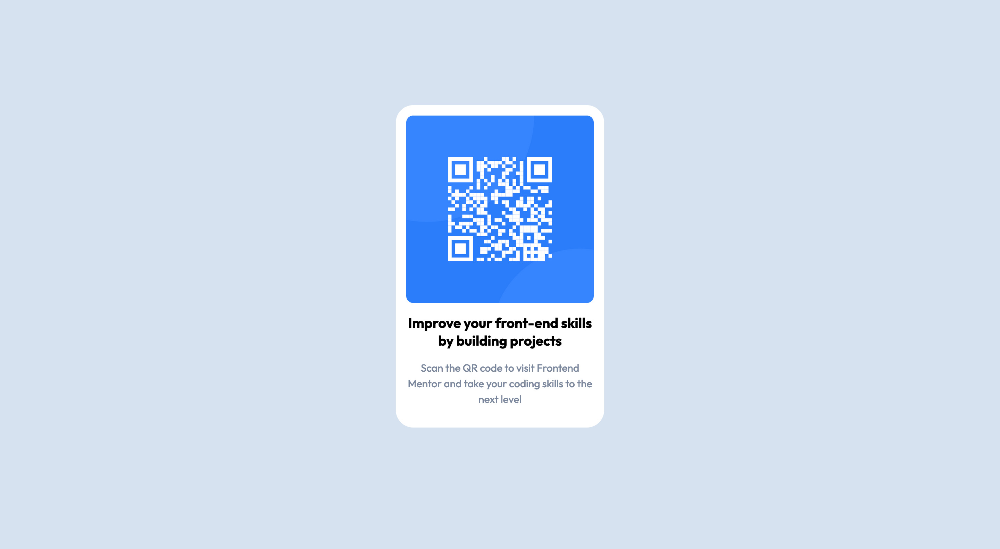

# Frontend Mentor - QR code component solution

This is a solution to the [QR code component challenge on Frontend Mentor](https://www.frontendmentor.io/challenges/qr-code-component-iux_sIO_H). 

## Table of contents

- [Overview](#overview)
  - [The challenge](#the-challenge)
  - [Screenshot](#screenshot)
  - [Links](#links)
- [My process](#my-process)
  - [Built with](#built-with)
  - [What I learned](#what-i-learned)
  - [Useful resources](#useful-resources)
- [Author](#author)
- [Acknowledgments](#acknowledgments)

## Overview

### Screenshot



### Links

- Solution URL [- Solution URL:](https://www.frontendmentor.io/solutions/qr-code-component-solution-using-flexbox-LL48-YYW8S)
- Live Site URL: [Add live site URL here](https://your-live-site-url.com)

### Built with

- Semantic HTML5 markup
- CSS custom properties
- Flexbox

### What I learned 

This was my first project and I really enjoyed myself. Centering the container horizontally and vertically on the page was challenging, but, eventually, it panned out. I also learned about HTML landmarks and their importance for well-designed websites. 

```css
.container-parent { 
    display: flex;
    justify-content: center;
    align-items: center;
    height: 95vh;
}
```
### Useful resources

- [Stack Overflow](https://stackoverflow.com/questions/31217268/center-div-on-the-middle-of-screen) - This was helpful to understand better how vertical and horizontal alignment work. 

### Acknowledgments

[Pedro Belmonte](https://github.com/pedrobelmonte8). Thank you for your patience and support. 